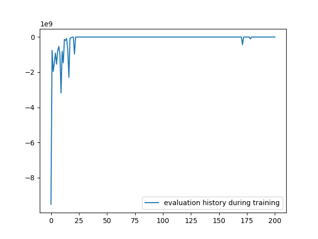
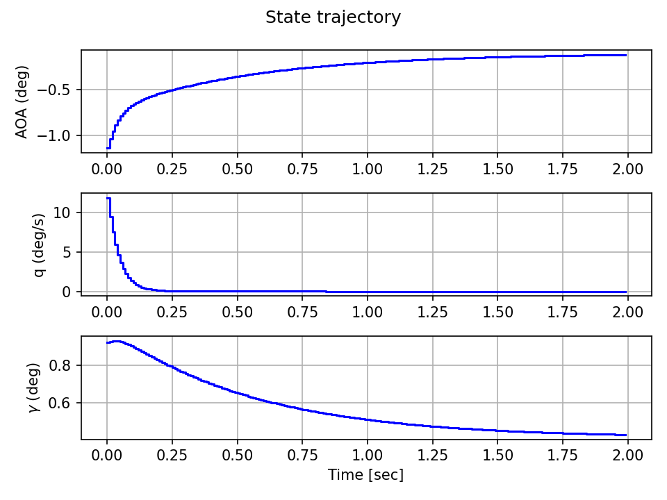
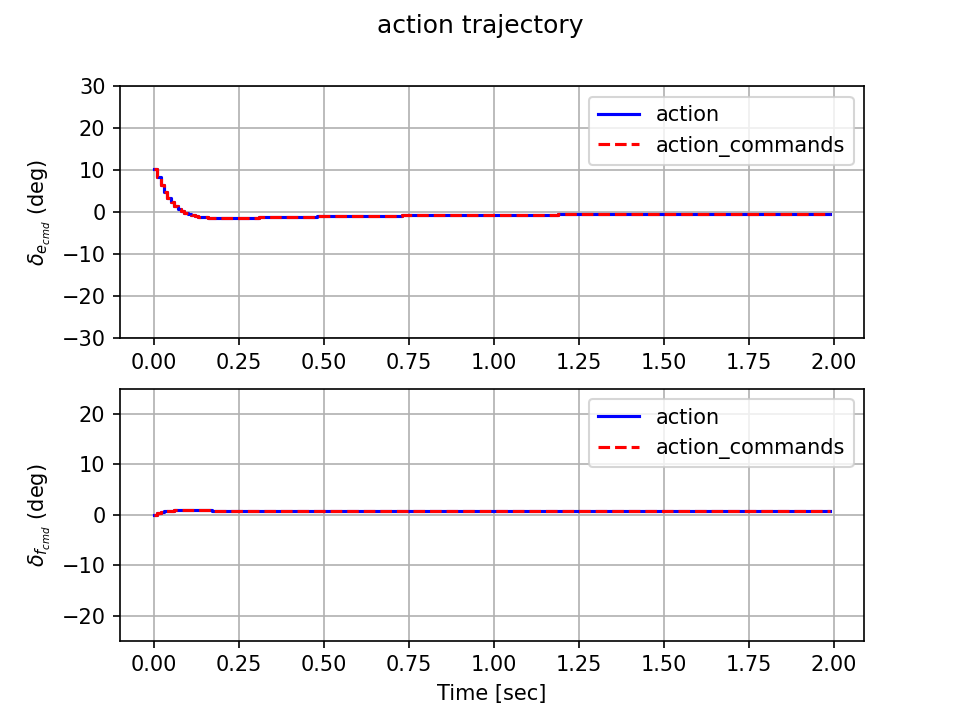
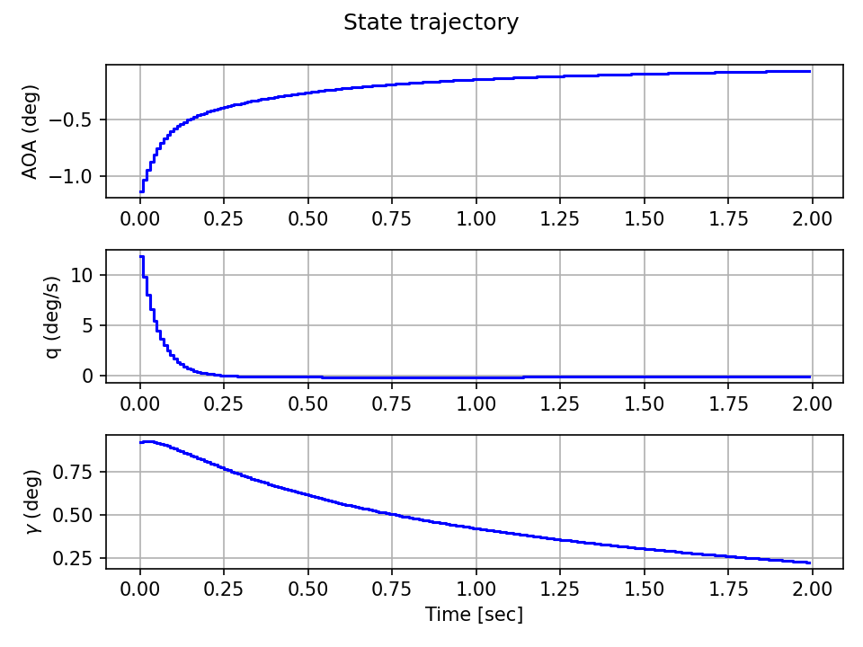
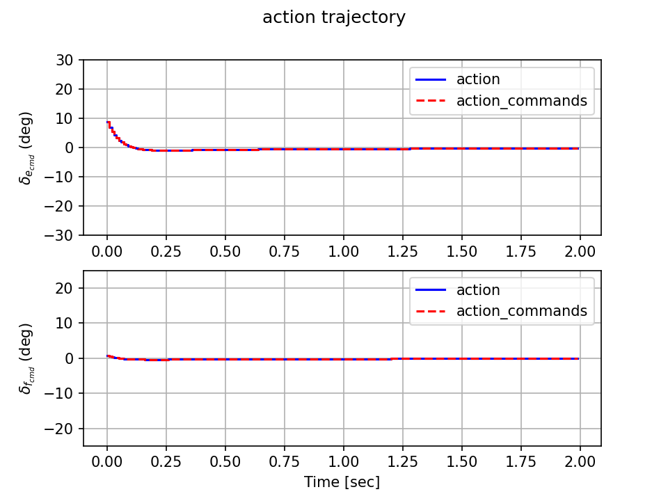

# ksas_2022_spring
Code for the paper, "Aircraft Controller Design Using Continuous-action Q-learning Based on Differentiable Convex Optimization", presented at KSAS 2022 Spring Conference.

## Installation
Install [poetry](https://python-poetry.org/).
The following command will install the defined dependencies for this project.
```
poetry install
```
Note: for the exact reproduction, use the `poetry.lock` provided in this repo.

### Results
Run `main.py` to reproduce the result.
- This is for training Q function via PCQL algorithm (proposed).
    - (Algorithm) PCQL (proposed), a continuous-action Q-learning algorithm.
    - (Dynamics) Linearised CCV type fighter longitudinal model.
    - (Cost) Quadratic cost
- This may take a long time.

<details>
<summary>Epoch vs mean total reward history</summary>



</details>

<details>
<summary>PCQL agent (trained); mean total reward is about -6.1</summary>




</details>
<details>
<summary>LQR (true optimal); mean total reward is about -5.0</summary>




</details>


